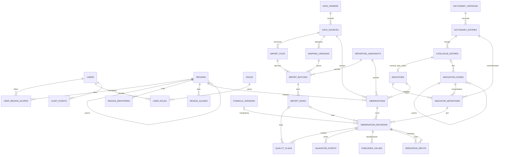

# Rancangan database MySQL/MariaDB — keputusan Fase 1A

2026-09-06. **Desain saja**, bukan migration/SQL yang dijalankan. Keputusan Fase 1A: Laravel 12 `api/` kanonis, PHP 8.2+ kompatibel lock, MySQL/MariaDB development/production dengan PDO MySQL dan identitas Laravel/Sanctum tunggal; UI same-origin session/cookie stateful + CSRF. Usulan nama tabel/kelas baru memerlukan review sebelum implementasi. Server/version dan schema kerja belum diverifikasi; desain harus dites pada versi target yang dipilih, termasuk enforcement CHECK/JSON/FK.

## Perbandingan schema yang ada

| Kontrak | Lokasi | Kondisi |
|---|---|---|
| Native aktif | `db.php::db()/initialize_database()` | SQLite users(password_hash,role), regions(type,province_code), metric_snapshots; auto-DDL/seed. Tidak digunakan pada audit |
| MySQL parsial | `database/Connection.php::create()`, `database/schema.sql` | PDO mysql utf8mb4, exception, fetch assoc, native prepare; users(role_id,password_hash), region_type/province_id; belum tersambung native db() |
| Laravel | `api/config/database.php`, lima migration di api/database/migrations | Default SQLite; mysql/mariadb connection disediakan; users(password,role), sessions, reset tokens, cache/locks, jobs/batches/failed_jobs, personal_access_tokens. Belum katalog wilayah/periode/indikator |
| Importer lama | `ExcelWorkbookImporter::previewFile/importFile` | 52 kode legacy; satu group excel_import; source Excel tidak setara owner; checksum bukan kunci unique batch; shared formula tidak selalu ditandai derived |

Jangan menjalankan SQL native ke schema users Laravel: nama/semantik kolom berbeda. Keputusan identitas target memakai Laravel users/password, role terkontrol dan scope wilayah; kompatibilitas identitas lama hanya setelah inventaris MySQL baca-saja dan keputusan migrasi. Data dummy tidak menjadi baseline nilai Jawa Barat. `.env.example` native memakai DB_NAME/DB_USER/DB_PASS/DB_DRIVER, Laravel memakai DB_DATABASE/DB_USERNAME/DB_PASSWORD/DB_CONNECTION; rencana harus menetapkan kontrak tunggal Laravel tanpa menyalin rahasia atau default fallback SQLite.

## Tabel target dan constraint

Semua PK internal BIGINT UNSIGNED kecuali tabel referensi kecil boleh SMALLINT UNSIGNED. FK mengikuti tipe yang sama; InnoDB/utf8mb4. Identifier bisnis berupa string stabil, bukan label/no urut. Waktu audit UTC DATETIME(6); tanggal sumber DATE. ON DELETE RESTRICT untuk data/provenance/aktor (nonaktifkan identitas, jangan putus sejarah).

| Tabel | Kolom inti / tipe | Key, constraint dan indeks |
|---|---|---|
| users (Laravel) | id, name, email, password, is_active, timestamps | Email UNIQUE; password hidden/hashed. Akun demo terpisah testing |
| roles, user_roles | roles.code; user_id, role_id | code UNIQUE; UNIQUE(user_id,role_id), FK; role enum bisnis disepakati. Masa transisi role string tidak jadi authority kedua |
| regions | id, parent_id nullable FK self, level (country/province/regency/city/district/village/urban_village), name, valid_from/to | Indeks(parent_id,level); tanggal valid; larang siklus, parent berlevel benar dalam service+test. Negara dapat menjadi root; provinsi child sesuai kebutuhan, tanpa hardcode 32 pada query |
| region_identifiers | region_id, authority VARCHAR(30), code VARCHAR(32), version VARCHAR(30), valid_from/to | UNIQUE(authority,version,code). Kode BPS/Kemendagri tidak dicampur; crosswalk eksplisit |
| region_aliases | source_id, source_schema_version, province_region_id, raw_name, normalized_name, region_id | UNIQUE(source_id,source_schema_version,province_region_id,normalized_name); unknown/lebih dari satu kandidat dikarantina |
| user_region_scopes | user_id, region_id, include_descendants BOOL, permission VARCHAR(30) | UNIQUE(user_id,region_id,permission), indeks(region_id,user_id); scope berlaku server-side semua read/write |
| reporting_snapshots | id, as_of_date DATE NOT NULL, year_number SMALLINT / month_number TINYINT turunan YEAR/MONTH(as_of_date), label opsional | UNIQUE(as_of_date); indeks(year_number,month_number,as_of_date). Tahun/bulan bukan identity pengganti tanggal. Valid date tanpa data tetap no-data, tidak fallback latest/hari ini |
| navigation_nodes | key, parent_id, kind(menu/subtab/block), catalogue_code nullable FK, label, sort_order, configured_link nullable | key UNIQUE, FK parent; MAP.1 feature/menu Penampil Peta BHUMI mengacu catalogue_entries; tanpa nilai numerik, URL hanya konfigurasi valid, bukan API/embed |
| dictionary_versions | id, checksum CHAR(64), file_name, received_at, status | checksum UNIQUE; original file tetap immutable |
| dictionary_entries | dictionary_version_id, sheet_name, row_number, source_code, original_no, metadata JSON | UNIQUE(version,sheet,row). Menampung 58 entri termasuk XIX.1 duplikat tanpa kehilangan |
| catalogue_entries | id, canonical_code VARCHAR(80), entry_kind (indicator/feature), dictionary_entry_id FK, source_code VARCHAR(80) | UNIQUE(canonical_code); 58 entri kanonis, 57 indikator + MAP.1 feature. XIX.1 layanan tetap; MAP.1 source_code XIX.1/r62. Source_code bukan unique lintas seluruh katalog |
| indicators | id, catalogue_entry_id FK catalogue_entries, is_active | UNIQUE(catalogue_entry_id); service/migration memastikan hanya catalogue entry `entry_kind=indicator` yang dapat menjadi indikator, sehingga MAP.1 feature tidak masuk tabel nilai |
| indicator_definitions | indicator_id, version INT, dictionary_entry_id, navigation_node_id, label, value_kind, canonical_unit, display_unit, display_scale DECIMAL(24,8), owner_id, aggregation_rule, is_derived, min/max | UNIQUE(indicator_id,version); FK kamus; tahun/rentang/status bukan string bebas tanpa validasi; definisi immutable setelah dipakai |
| data_owners | code, organization_type, name | code UNIQUE; Pemda/Kantah/ATR-BPN sebagai owner, berbeda kanal Excel/manual/API |
| indicator_permissions | definition_id, role_id, permission | UNIQUE(definition_id,role_id,permission); izin manual hanya owner; turunan tidak editable |
| data_sources | code, owner_id, channel(excel/manual/kkp/system), label, contract_version | code UNIQUE; URL metadata opsional tanpa token; secret di environment/secret store |
| import_files | checksum SHA256, filename, byte_size, source_id, received_by/at, private_storage_key | UNIQUE(source_id,checksum); lokasi private bukan public; immutable |
| mapping_versions | source_id, dictionary_version_id, version, header_fingerprint, rules_json, approved_by/at | UNIQUE(source_id,version); hanya formula/transformasi allowlist, tanpa eval |
| import_batches | file_id, mapping_version_id, snapshot_id, scope_region_id, idempotency_key CHAR(64), status, counters, actor_id, timestamps | UNIQUE(idempotency_key); key hash(file checksum+source+mapping+as_of_date+scope). Indeks(status,created_at) |
| import_rows | batch_id, sheet_name, row_number, raw_region, resolved_region_id nullable, raw_cells JSON, errors JSON, status | UNIQUE(batch_id,sheet_name,row_number); FK. Sel menyimpan alamat, tipe, style, formula/shared master, cached value, source time |
| observations | id, region_id, snapshot_id, indicator_id, source_id, dimension_key VARCHAR(128) NOT NULL default total | UNIQUE(region_id,snapshot_id,indicator_id,source_id,dimension_key). Identity stabil, belum nilai aktif |
| observation_revisions | id, observation_id, version INT, definition_id, import_row_id nullable, input_method, owner_id, actor_id, observed_start/end, source_as_of DATE nullable, source_period_text, formula_version_id nullable FK, missing_reason, typed value columns, created_at, payload_hash | UNIQUE(observation_id,version); FK provenance; immutable; indeks(observation_id,created_at). Snapshot_id mengacu tanggal identitas as_of_date; observed waktu sumber terpisah |
| quality_flags | id, import_row_id nullable FK, revision_id nullable FK, rule_code, severity, source_column, evidence JSON, resolution_status, resolved_by/at nullable | CHECK minimal satu FK target; indeks(rule_code,resolution_status), (import_row_id,source_column). Raw value/formula/result tetap immutable; flag bukan menghapus evidence atau otomatis approval |
| validation_events | revision_id, from_status, to_status, actor_id, reason, evidence_ref, created_at | Append-only; draft→submitted→validated→approved atau rejected; reviewer scope dan pemisahan pencatat/pengesah |
| published_values | region_id, snapshot_id, indicator_id, dimension_key, revision_id, approved_by/at | UNIQUE(region,snapshot,indicator,dimension); FK revision; update atomik dengan audit. Pastikan key cocok observation melalui composite FK atau constraint/service+test |
| formula_versions | definition_id, version, formula_key, expression_spec JSON, denominator_policy, rounding_policy | UNIQUE(definition_id,version); allowlist operator/dependencies; DAG, larang siklus |
| derivation_inputs | derived_revision_id, input_revision_id, variable_key | UNIQUE(derived_revision_id,variable_key); FK, provenance tiap perhitungan; formula_version_id pada revision turunan |
| audit_events | actor_id nullable untuk system, action, entity_type/id, old_revision_id/new_revision_id, request_id, reason, created_at | Append-only; indeks(entity_type,entity_id,created_at), (actor_id,created_at). Tidak menyimpan password/token/session/raw request rahasia |
| spatial_assets (opsional fase lanjut) | region_id, source_id, external_id, geometry_ref, valid_from/to, metadata | UNIQUE(source_id,external_id,valid_from); tidak diisi dari angka agregat; tidak mengarang geometri BHUMI |

`dimension_key=total` tidak nullable agar UNIQUE benar. Tujuh jenis layanan sudah punya kode indikator persentase sendiri; pembilang berkas per jenis perlu definisi pendukung tersendiri dengan approval, bukan mengarang kode kamus. Dimension hanya untuk breakdown yang definisinya eksplisit (misalnya kelas nilai). Simpan unit/versi definisi pada revision agar perubahan katalog tidak mengubah interpretasi historis.

## Tipe nilai dan validasi

| Makna | Penyimpanan revisi | Aturan |
|---|---|---|
| Rupiah, luas, durasi desimal | value_decimal DECIMAL(24,6) | Rupiah exact decimal; display /1e9 atau /1e12. Luas ha/m2 mengikuti canonical unit. Tanpa floating point untuk uang |
| Jumlah bidang/berkas, GAP | value_integer BIGINT signed | Nonnegatif untuk jumlah; **GAP VI.3 boleh negatif**. Jangan global CHECK >=0 |
| Persentase | value_decimal DECIMAL(24,6) | Canonical 0–100; formula numerator/denominator disimpan provenance, clamp dilarang karena menyembunyikan error |
| Kategorikal | value_status_code VARCHAR(40) FK/domain berdasarkan definition | Ada/tidak_ada, sudah/belum, unknown berbeda. Jangan substring “ada” mengubah “tidak ada” |
| Tahun | value_year SMALLINT UNSIGNED | YYYY yang masuk rentang definisi; bukan DATE palsu 1 Januari |
| Rentang nilai dominan | value_min/value_max DECIMAL(24,6), value_class VARCHAR(80) | min<=max; kelas/domain eksplisit; mean tidak menggantikan mode/range |
| Teks kebutuhan tertentu | value_text TEXT | Panjang/sanitasi/domain; bukan menampung semua angka sebagai string |
| Data tidak ada | Semua value NULL, missing_reason terkontrol | bedakan absent/blank/dash/not_collected/not_applicable/invalid; nol hanya dari sumber |

CHECK jumlah kolom bertipe yang terisi harus tepat satu cabang sesuai value_kind; range merupakan satu cabang dua batas (boleh kelas-only jika definisi mengizinkan). Kind disalin sebagai discriminator dengan FK komposit ke definition atau dijaga trigger/service dan integration test, tidak cukup validasi frontend. Revision derived harus punya formula_version, input revisions, bukan input manual; definisi/satuan/region/periode antar input harus sesuai rule. Rasio agregat recompute dari sum yang sebanding; tidak SUM persentase. Status dan durasi tanpa rule agregasi tidak diberi total provinsi. Coverage 25 wilayah selalu disertakan, bukan klaim total 27.

## ERD konseptual

ERD merangkum hubungan utama; kolom/constraint tabel di atas adalah bagian desain yang sama. Tidak ada migration dibuat.

## Idempotensi, input Pemda dan concurrency

1. Baca file immutable, hitung checksum, identifikasi sheet/header/merge/style. Tidak import r1–r5, note atau baris kosong r31–987. Resolve wilayah lewat alias+provinsi+versi authority; NO hanya metadata. Unknown tetap staging, bukan auto-create wilayah.
2. as_of_date snapshot wajib sah sebelum impor; snapshot_id mereferensikan reporting_snapshots.as_of_date. Nilai tanggal pertama belum diberikan. observed_start/end/source_as_of dan source_period_text per kelompok mempertahankan waktu asli, bukan otomatis tanggal impor. Nilai ambigu dikarantina per cell; jangan kehilangan kolom tambahan yang belum mempunyai kode.
3. Unique batch idempotency key mencegah reimport file/mapping/periode/scope sama, termasuk dua request paralel. Replay completed mengembalikan hasil yang ada; failed dicoba ulang sebagai attempt tercatat, bukan duplikasi nilai.
4. File atau mapping versi baru: staging/diff terhadap revision sebelumnya. Lock observation atau optimistic version; validasi uniqueness; buat revision hanya jika payload/provenance semantik berubah. Tidak menimpa sumber manual/approved dengan Excel baru secara otomatis. Missing baru mengusulkan revision missing, bukan menghapus sejarah.
5. Commit staging/nilai/revisi/audit atomik dalam transaksi DML; kegagalan rollback nilai. Catatan attempt failure disimpan sesudah rollback dalam transaksi terpisah tanpa rahasia. DDL versi ditangani migration terpisah, bukan satu transaksi impor.
6. Pemda: izin role + wilayah + indikator + periode yang terbuka; CSRF dan server validation; expected_revision_id mencegah lost update. PAD/GAP/rasio dihitung sistem. Sumber Excel awal dan manual tetap dua observation source berbeda, pemilihan published revision berdasarkan keputusan owner/approval per indikator.
7. Publication atomik mengganti pointer setelah approval, audit siapa/dari/ke/alasan dan data input formula. Turunan invalidated/recomputed saat input berubah; approval ulang sesuai kebijakan. Tidak mengubah dokumen/input historis.

## Banyak provinsi dan periode

Master Jawa Barat berisi seluruh wilayah referensi yang telah disetujui; hanya 25 memiliki nilai impor pertama. Kabupaten Bogor/Pangandaran dan level lebih rendah tidak dibuat nilai kosong palsu atau nol. Provinsi lain ditambah sebagai region di bawah negara yang sesuai (atau root saat level negara belum diperlukan) dan mapping versi sumber, tanpa mengubah schema inti. Snapshot memakai as_of_date sebagai identitas tanggal data; tahun/bulan turunan, bukan identitas baru. Metadata tanggal/cakupan sumber tetap menyimpan 2025/Maret/Juli 2026 sehingga tidak diklaim observasi serentak. Filter menggunakan indeks published_values(region,snapshot,indicator,dimension), observations(region,snapshot,indicator,source,dimension), regions(parent,level), revisions(observation,version), batches(idempotency_key,status).

Keputusan kode sudah final: XIX.1 layanan dan MAP.1 fitur. Sisa sebelum penggunaan data: authority/versi master, nilai as_of_date pertama, metadata cakupan waktu, denominator layanan/sebaran, detail role migrasi dan akses/schema MySQL target; semua belum diverifikasi runtime. Test wajib: FK orphan, cycle region, invalid value type/unit, duplikat impor concurrent, rollback, blank vs zero, signed GAP, periode berbeda, provinsi kedua, scope Pemda lintas wilayah, approved tidak tertimpa, revisi/audit lengkap. Tidak satu pun migration/impor dilakukan pada Tahap 0 atau Fase 1A.

## Penegasan kontrak snapshot dan lineage Fase 1A

Ini keputusan/desain, bukan schema yang sudah tersedia. reporting_snapshots adalah referensi tanggal (UNIQUE as_of_date); observations mengikat region_id + snapshot_id + indicator_id + source_id + dimension_key. Dua tanggal dalam bulan sama menghasilkan identity berbeda; revisi untuk tanggal yang sama memakai observation_revisions, bukan snapshot duplikat. Tahun/bulan dapat generated columns atau dihitung query/service sesuai versi MySQL/MariaDB yang kelak diverifikasi; tidak boleh diinput bebas tidak sinkron tanggal.

Tanggal as_of_date bukan otomatis tanggal upload/import, bukan nama sheet yang ditebak. Jika tanggal sumber hanya diketahui tahun/rentang/teks, simpan source_period_text dan tanggal parsial/rentang yang benar; jangan memalsukan tanggal 1 Januari. Nilai tanggal snapshot awal harus diberikan/disahkan sebelum impor. Filter tanggal valid tanpa observation terpublikasi mengembalikan no-data pada tanggal itu. Filter tahun/bulan memilih daftar snapshot atau agregasi sesuai tipe indikator; tidak SUM stok antar tanggal secara default. Tampilan provinsi mencatat coverage tanggal/indikator sama, bukan menjumlah parent-child sekaligus.

catalogue_entries menyimpan `UNIQUE(canonical_code)`. `indicators.catalogue_entry_id` merujuk ke katalog dan hanya menerima entry_kind `indicator` melalui migration/service yang diuji; desain ini menghindari unique key komposit yang bertentangan. Total 58 entri: 57 indikator data dengan XIX.1 tetap layanan, dan MAP.1 entry_kind=feature. MAP.1 mengacu dictionary_entries sheet Kamus Data row_number=62 dan source_code=XIX.1; raw label PETA GTRA tidak diganti di source. navigation_nodes memakai MAP.1 sebagai feature/menu; observations hanya dapat merujuk indicators, sehingga tidak membuat nilai angka kosong/dummy untuk peta.

quality_flags menyimpan rule_code terkontrol (nama usulan): APL_AREA_DELTA, NIB_NOP_TEXT_SIGN_MISMATCH, RDTR_ZERO_DENOMINATOR, RDTR_DEFINITION_PENDING, MISSING_DASH, MISSING_BLANK, INVALID_INPUT. Contoh raw evidence tetap cell C/D/E/P/AO:AQ/AR beserta formula/result, sheet, row/column, checksum file via FK import_files dan versi mapping. Unresolved flag tidak dihapus ketika hasil kanonis dihitung; severity/approval menentukan publikasi, no-data diterapkan pada formula yang inputnya tidak valid. Tidak semua flag harus menghilangkan seluruh baris wilayah.

## Formula kanonis dan pemilihan sumber — keputusan Fase 1A

| Kelompok | Input dasar dan kanal | Hasil domain/service | Evidence / penanganan |
|---|---|---|---|
| APL I.1–3 | C,D,E dari Excel | I.1=C, I.2=100*D/C, I.3=100-I.2 jika denominator valid; luas turunan C-D disimpan berbeda dari E source | 10 selisih ±1 ha quality flag; C/D/E/F/G mentah tetap, jangan menyesuaikan sumber diam-diam |
| Terpetakan II | C/BB Excel | II.1=C-BB ha, II.2=BB ha | BA jumlah bukan luas; invalid subset/unit QC, tanpa clamp |
| PAD V | H PBB + J BPHTB | V.1=H+J rupiah, display miliar | L cache evidence. PBB Excel awal lalu manual Pemda; BPHTB Excel awal, API ditunda kontrak |
| GAP VI | N NIB dan O NOP | signed N-O; tanda >0 / =0 / <0 menghasilkan NIB > NOP / NIB = NOP / NIB < NOP; missing input -> NULL/no-data status | P6/P7 source tetap + flag; M koneksi evidence, bukan sumber status perbandingan. NOP pembaruan manual Pemda; NIB Excel awal |
| RDTR IX | AO total/terbit dan AP terintegrasi input Excel | IX.2=AP/AO*100; IX.3=100-IX.2 hanya AO>0 dan dasar valid | AO nol/kosong -> dua persen NULL/no-data, bukan 0/100. AQ/AR evidence/QC sampai definisi tervalidasi. AP negatif/lebih total/missing -> QC dan hasil invalid/no-data, tidak clamp |
| Aset XI | Pemda manual dasar U/X/Y/Z; Excel valid boleh nilai awal | XI.1=100*X/(U+X), XI.2 luas Y, XI.3 nilai Z; persen tidak manual bebas | AA cache evidence; dash/blank berbeda dari nol; unit m2/Rp tetap |
| Kredit/TORA/umum tersedia | Q/R/S/AM/AK/AL dan mapping valid Excel | Formula yang tercatat dihitung service, bukan raw cache sebagai input bebas | Source_as_of/source_period_text berbeda tahun tetap lineage |
| PKKPR/FPR/Pemda tanpa kolom | Manual Pemda | Validasi tipe/wilayah/snapshot dan revision | Awal no-data; jangan mengambil HT sebagai potensi investasi |
| Sebaran XII | Excel/KKP jika objek dan detail valid tersedia | Agregasi hanya coverage yang sah | U bidang belum bukti Hak Pakai; kec/desa absen no-data |
| Kantah/E-Sertipikat/ZNT detail/dominan | Belum ada sumber valid | No-data | Tidak gunakan dummy, NIK/sertipikat biasa atau ZNT rata-rata sebagai pengganti |
| MAP.1 | Feature placeholder/link terkonfigurasi | Tidak ada observation numerik | source_code XIX.1; tidak mengarang API/token/embed |

Data awal operasional hanya Input Data Jawa Barat.xlsx; workbook kamus hanya metadata. Input manual dan Excel sama-sama di MySQL dengan source/owner/lineage terpisah, bukan database/auth paralel. Pemda hanya dapat mengubah dasar yang dimiliki sesuai scope wilayah; formula service dan publication tetap terkendali. Penggantian nilai Excel awal oleh manual harus revision + audit/approval, bukan overwrite raw.

## Implementasi Fase 2B (2026-09-06)

Schema minimal yang diimplementasikan pada MariaDB 10.4 memakai delapan migration berurutan. Migration starter membuat `users`, cache/jobs dan tabel resmi Sanctum. Fase 2B menambah `roles`, `user_roles`, `regions`, `user_region_scopes`, `data_owners`, `data_sources`, `categories`, `submenus`, `indicators`, `reporting_snapshots`, `observations`, `observation_revisions`, `quality_flags`, dan `audit_events`.

`users.password` adalah credential kanonis, `is_active` default true dan terindeks. Migration normalisasi menyalin hanya `password_hash` yang dikenali PHP sebagai hash valid ke `password`; akun tanpa password/hash valid dinonaktifkan. Role legacy yang cocok tepat dengan lima code kanonis dipindah ke pivot. Role tidak dikenal tidak dipetakan. Kolom `password_hash`, `role`, dan `role_id` kemudian dihapus; rollback sengaja tidak menghidupkan kembali authority lama.

Foreign key pivot memakai cascade saat user/role/scope dihapus. Master/provenance memakai restrict, sedangkan actor revision/audit menjadi null bila user dihapus. Unique utama: role code, internal region code, canonical indicator code, pasangan user-role/user-region, tanggal snapshot, identity observation `(region,snapshot,indicator,source,dimension)`, dan nomor revision per observation. Snapshot hanya `as_of_date`; query aplikasi kelak wajib mencari tanggal yang diminta tanpa fallback latest.

Katalog minimal menyimpan 58 baris fisik dalam `indicators` sebagai catalogue records: 57 indikator data dan satu record feature dengan `is_feature=true`. `MAP.1` unik, `source_code=XIX.1`, `source_row=62`; `XIX.1` layanan tetap di source row 15. Feature dan indikator derived tidak dapat menerima input manual. Observation/revision/quality/audit sudah tersedia untuk Fase 3, tetapi tidak diisi nilai aktual pada 2B.

Policy `IndicatorPolicy` memisahkan `view`, `update` manual, dan `import`. Semua jalur memeriksa akun, role aktif, region aktif, owner dikenal/aktif, serta scope wilayah. Scope provinsi mencakup child kabupaten/kota satu tingkat. `super_admin` mendapat lintas wilayah secara eksplisit, tetapi tetap tidak dapat menulis manual feature BHUMI atau nilai turunan. Operator Pemda/Kantah hanya menulis input manual owner masing-masing; admin BPN hanya mengimpor owner `atr_bpn`; viewer hanya membaca. Unknown/missing selalu deny.

data/dashboard.sqlite tidak dihapus: artefak legacy sampai audit migrasi selesai, bukan fallback MySQL. Native tidak dihapus sebelum halaman Laravel pengganti feature parity terverifikasi; target akhirnya satu aplikasi/identitas/database. Tidak ada seed dummy production otomatis. Fase 1B menyiapkan prasyarat, 2A fondasi auth (schema standar hanya test bila dibutuhkan), 2B migration/master domain, 3A katalog/manual, 3B importer/QC. Tidak ada migration atau runtime diubah pada Fase 1A.

## Implementasi Fase 3A (2026-09-06)

Migration `2026_09_06_000004_create_definition_and_workflow_tables` menambahkan `indicator_definitions`, FK definition/source dan `change_note` pada revision, `revision_status_events`, serta `published_values`. Migration korektif `2026_09_06_000005_reconcile_observation_identity_and_definition` mengembalikan unique identity observation menjadi `(region_id, reporting_snapshot_id, indicator_id, data_source_id, dimension_key)`. Migration korektif memeriksa duplikasi lebih dahulu dan berhenti tanpa menghapus data bila konflik ditemukan. Migration itu juga menghapus formula placeholder XIII.4 dari data yang pernah di-seed; migration `000004` yang telah diterapkan tidak diedit.

`indicator_definitions` menyimpan nomor versi, `valid_from`/`valid_to`, tipe nilai, unit, aturan validasi JSON, metadata formula yang terdokumentasi, dan status aktif. Revision mereferensikan definition yang dipakai sehingga perubahan definisi berikutnya tidak mengubah arti data historis. Seeder membuat 57 definition versi 1 dan tidak membuat definition untuk MAP.1. XIII.4 tetap ada di katalog dengan `quality_status=definition_pending`, bukan derived, serta tanpa formula sampai konflik definisinya disahkan.

API manual membuat identity observation untuk indikator + wilayah + snapshot `as_of_date` + source turunan server + dimension `total`. Source tidak diterima dari client: owner Pemda selalu memakai `manual_pemda`, owner Kantah memakai `manual_kantah`. Nilai dinormalisasi ke kolom typed revision sesuai definition. Decimal diproses sebagai string fixed-scale enam digit; float besar ditolak agar presisi tidak hilang. Batas hanya di-seed bila telah diputuskan: percentage 0–100, integer nonnegatif untuk input dasar, tahun YYYY, serta status dalam domain terdokumentasi.

Revision dibuat append-only dalam transaksi dengan nomor berurutan, checksum payload, actor, source, raw value, normalized value, note, dan definition. Update nilai atau delete revision ditolak model. `expected_revision` dan row lock mencegah lost update; stale revision atau payload identik menghasilkan HTTP 409. Workflow adalah `draft -> submitted -> published|rejected`. Operator sesuai owner/scope membuat dan submit; hanya `super_admin` publish/reject sementara; published pointer diperbarui atomik. Audit menyimpan ID resource, actor, action, region, indicator, revision dan status tanpa value, note, token, password, header, atau credential.

Semua route domain memakai `auth:sanctum` dan `EnsureAccountIsActive`, lalu Gate/Policy memeriksa akun, role, ownership dan scope wilayah secara terpisah. Scope provinsi mencakup kabupaten/kota anak; scope kosong dan role/owner tak dikenal deny. Viewer hanya melihat revision published. Pemda/Kantah hanya menulis owner masing-masing; admin BPN, viewer, derived, deferred, KKP/Excel dan BHUMI tidak dapat memakai endpoint manual.

Testing dibangun ulang dari nol pada `dashboard_pertanahan_test` dengan 10 migration dan seeder dijalankan dua kali. Hasil akhir 29 test/376 assertions PASS; Fase 2A tetap 7/107 PASS. Development `dashboard_pertanahan_dev` menerima migration `000005` dan seeder secara non-destruktif setelah seluruh test lulus; 10 migration Ran dan observation/revision tetap 0. Import Excel, perhitungan formula runtime, quality flag hasil impor, serta endpoint master-data tetap untuk Fase 3B/4A.

## Implementasi Fase 3B MVP (2026-09-06)

Migration `2026_09_06_000006_create_excel_import_staging_tables` menambah `import_batches`, `import_rows`, `import_values`, dan `import_quality_flags`, serta FK `observation_revisions.import_value_id`. Batch unik berdasarkan checksum file + `as_of_date` + mapping version. Staging cell menyimpan sheet/row/column, raw value, cached value, formula type/shared index, formula sumber, number format, source period/header, mapping indicator, normalized value, status, dan error. Definition versi 1 diperluas mulai `2026-08-04` melalui migration baru agar snapshot sumber memakai definition efektif; migration lama tidak diedit.

Command `dashboard:import-jabar` hanya menerima workbook Jawa Barat kanonis. `--dry-run` membaca dan memvalidasi tanpa menulis. Commit berjalan dalam transaksi; error blocking menyimpan batch/staging/QC berstatus blocked tanpa observation/revision. Import sukses membuat revision draft hanya untuk input dasar owner ATR/BPN yang memiliki tepat satu definition efektif. Checksum semantik mencegah revision baru bila nilai normalized tidak berubah; idempotency key mengembalikan batch lama untuk file/tanggal/mapping identik. File berubah dengan nilai berubah membuat revision berurutan baru pada observation yang sama.

Development final memiliki satu batch completed, 25 import rows, 1.350 import values, 292 formula cells, 446 import QC flags, satu audit event, satu snapshot, serta 225 observation dan 225 revision draft pada 25 wilayah × 9 indikator. Seluruh revision Excel memiliki FK staging, source period, sheet, row, column, dan checksum; 0 observation non-ATR dan 0 published value. Testing memiliki 11 migration Ran dan kembali 0 batch/observation setelah transaction rollback. Full suite: 35 test/471 assertions PASS.
