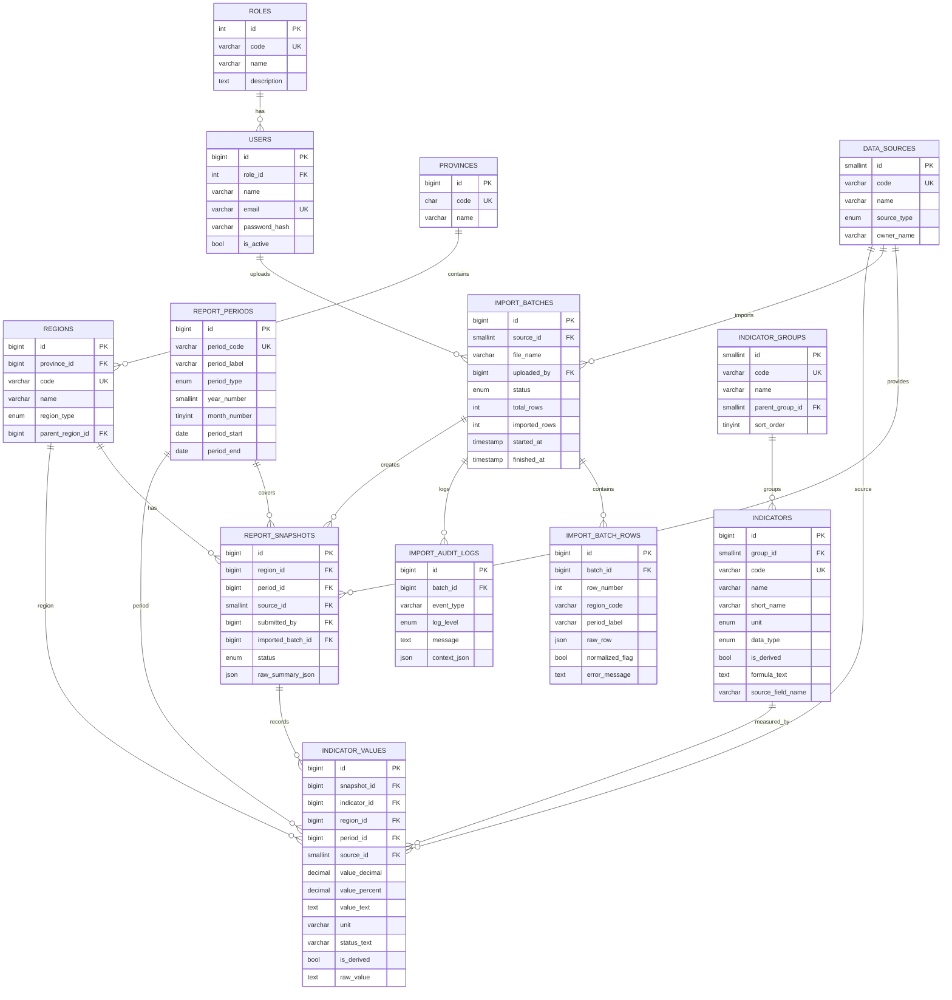

# Desain database target untuk dashboard pertanahan

## 1. Tujuan desain

Desain ini menjawab kebutuhan multi-provinsi dan multi-periode, tanpa menyalin 54 kolom Excel menjadi satu tabel flat. Struktur dibuat untuk memisahkan:

- wilayah (provinsi/kabupaten/kota)
- periode pelaporan
- sumber data (excel, Pemda, KKP, sistem)
- pengguna dan role
- kelompok indikator dan indikator
- nilai indikator per wilayah-periode
- batch impor dan audit log impor

Tujuannya adalah menjaga data mentah untuk audit, menjaga integritas relasional, dan memungkinkan dashboard dibangun modul-per-modul sesuai menu dan submenu yang disepakati.

## 2. ERD (Mermaid)

## 3. Prinsip normalisasi

### 3.1 Struktur utama

- `provinces` dan `regions` menyimpan master wilayah.
- `report_periods` menyimpan periode pelaporan dan label periode.
- `data_sources` menyimpan sumber data: Excel, Pemda, KKP, dan sistem.
- `indicator_groups` menyimpan menu/submenu seperti Informasi Umum, Keuangan Daerah, Iklim Investasi, Aset Pemda, Layanan Pertanahan, Tata Ruang, dan Peta Bhumi.
- `indicators` menyimpan definisi indikator baku per data point.
- `report_snapshots` menyimpan snapshot per wilayah/periode/sumber.
- `indicator_values` menyimpan nilai indikator per snapshot.
- `import_batches` dan `import_audit_logs` menjaga integritas impor Excel dan audit trail.
- `import_batch_rows` menyimpan raw JSON untuk menjaga nilai mentah sebelum normalisasi.

### 3.2 Aturan null

- `NULL` diperbolehkan hanya untuk field yang memang tidak pernah diisi atau belum tersedia.
- `value_decimal` nullable jika indikator tidak memiliki angka numerik.
- `value_text` nullable jika indikator bukan teks.
- `raw_value` harus selalu diisi untuk data yang diimpor agar audit dapat dipelajari.
- `status_text` nullable untuk indikator status yang belum tersedia.
- `formula_text` nullable untuk indikator non-derived.

## 4. Satuan dan tipe data

Semua nilai numerik harus dipisahkan dari string, dan semua satuan dijelaskan di definisi indikator. Gunakan DECIMAL, bukan FLOAT.

- `ha` => `DECIMAL(18,4)`
- `m2` => `DECIMAL(18,4)`
- `rp` => `DECIMAL(18,2)` atau `DECIMAL(18,4)` sesuai kebutuhan
- `percent` => `DECIMAL(5,2)`
- `count` => `BIGINT` atau `DECIMAL(18,0)` bila perlu
- `status` / `text` => `VARCHAR` atau `TEXT`

Aturan umum:
- angka harus disimpan tanpa simbol mata uang dan tanpa tanda `%`
- persentase disimpan sebagai angka desimal, misal `51.00` untuk `51%`
- satuan dicatat di `unit` dan `indicators.unit`
- saat nilai berasal dari formula turunan, `is_derived = 1` dan `formula_text` diisi

## 5. Formula turunan dan indikator utama

Formula turunan yang umum dipakai di dashboard:

- persentase sertipikat = `luas_sertipikat / luas_apl * 100`
- persentase belum sertipikat = `luas_belum_sertipikat / luas_apl * 100`
- jumlah pendapatan total = `PBB + BPHTB`
- persentase PBB = `PBB / jumlah_pendapatan_pertanahan * 100`
- persentase BPHTB = `BPHTB / jumlah_pendapatan_pertanahan * 100`
- status koneksi NIB-NOP = kategori teks, bukan angka
- status integrasi OSS/RDTR = teks `Sudah` / `Belum` / `Belum Terlaksana`
- persentase kepemilikan lahan = `nilai sertifikat / total penduduk (umur >30)` atau rule bisnis yang ditentukan oleh pemilik data

Nilai mentah selalu harus disimpan di `raw_value` atau `import_batch_rows.raw_row` untuk audit impor.

## 6. Pemetaan kolom Excel ke model normalisasi

Berikut pemetaan kolom utama dari file Excel `JAWA BARAT (4 Agst)` ke model target. Struktur ini mengikuti 54 kolom yang terdeteksi di workbook, tanpa menyalin 54 kolom ke satu tabel flat.

| Kolom | Nama Excel / subheader | Model target | Unit / tipe | Keterangan |
| --- | --- | --- | --- | --- |
| C1 | NO | `import_batch_rows.row_number` / metadata | integer | urut baris impor |
| C2 | DAERAH | `regions.name` | text | kabupaten/kota |
| C3 | Luas APL (ha) | `indicator_values` -> `apl_total` | ha | indikator utama |
| C4 | Luas lahan bersertipikat (ha) | `indicator_values` -> `lahan_sertipikat` | ha | |
| C5 | blm bersertipikat (ha) | `indicator_values` -> `lahan_belum_sertipikat` | ha | |
| C6 | Luas lahan bersertipikat (%) | `indicator_values` -> `sertifikat_pct` | percent | |
| C7 | Luas lahan belum bersertipikat (%) | `indicator_values` -> `belum_sertipikat_pct` | percent | nilai turunan |
| C8 | PBB (Rp) | `indicator_values` -> `pbb` | rp | |
| C9 | % PBB | `indicator_values` -> `pbb_pct` | percent | nilai turunan |
| C10 | BPHTB (Rp) | `indicator_values` -> `bphtb` | rp | |
| C11 | % BPHTB | `indicator_values` -> `bphtb_pct` | percent | nilai turunan |
| C12 | JUMLAH PBB & BPHTB (Rp) | `indicator_values` -> `jumlah_pendapatan_pertanahan` | rp | total pendapatan sektor |
| C13 | STATUS Terkoneksi | `indicator_values` -> `nib_nop_status` | status | teks |
| C14 | NIB (BIDANG) | `indicator_values` -> `nib_bidang` | count | |
| C15 | NOP | `indicator_values` -> `nop` | count | |
| C16 | KETERANGAN | `indicator_values` -> `nib_nop_keterangan` | text | |
| C17 | HT (Rp) | `indicator_values` -> `hak_tanggungan_total` | rp | |
| C18 | TOTAL SERTIPIKAT YANG DI HT TAHUN 2025 (Bidang) | `indicator_values` -> `sertifikat_di_ht` | count | |
| C19 | TOTAL SERTIPIKAT TAHUN 2000 - 2026 (Bidang) | `indicator_values` -> `sertifikat_total_2000_2026` | count | |
| C20 | SERTIFIKAT (%) | `indicator_values` -> `sertifikat_pct` | percent | |
| C21 | Aset Pemda (Bidang) data s.d. Maret 2026 | `indicator_values` -> `aset_pemda` | rp | |
| C22 | Sudah Sertipikat | `indicator_values` -> `aset_pemda_sudah_sertifikat` | count | sub-kolom |
| C23 | Luas (m2) | `indicator_values` -> `aset_pemda_sudah_luas_m2` | m2 | sub-kolom |
| C24 | Nilai (Rp) | `indicator_values` -> `aset_pemda_sudah_nilai_rp` | rp | sub-kolom |
| C25 | Belum Sertipikat | `indicator_values` -> `aset_pemda_belum_sertifikat` | count | sub-kolom |
| C26 | Luas (m2) | `indicator_values` -> `aset_pemda_belum_luas_m2` | m2 | sub-kolom |
| C27 | Nilai (Rp) | `indicator_values` -> `aset_pemda_belum_nilai_rp` | rp | sub-kolom |
| C28 | % Belum Sertipikat | `indicator_values` -> `aset_pemda_pct_belum_sertifikat` | percent | nilai turunan |
| C29 | % Cakupan | `indicator_values` -> `cakupan_znt` | percent | |
| C30 | Luas belum (ha) | `indicator_values` -> `znt_luas_belum` | ha | |
| C31 | Tahun | `indicator_values` -> `znt_tahun` | year/date | |
| C32 | Nilai Rata-Rata ZNT (Rp.) | `indicator_values` -> `znt_rata_rata_nilai` | rp | |
| C33 | PKS | `indicator_values` -> `znt_pks` | text | |
| C34 | Tahun | `indicator_values` -> `kumuh_tahun` | year/date | |
| C35 | Luas wilayah kumuh | `indicator_values` -> `luas_kumuh` | ha | |
| C36 | Luas Usulan LP2B | `indicator_values` -> `luas_usulan_lp2b` | ha | |
| C37 | Ada Lokasi KT 5 Tahun Terakhir | `indicator_values` -> `lokasi_kt_5_tahun` | status | teks |
| C38 | Pembentukan GTRA (2018-2025) | `indicator_values` -> `gtra_pembentukan` | count | |
| C39 | GTRA Aktif (APBN 2026) | `indicator_values` -> `gtra_aktif` | count | |
| C40 | LUAS TORA BELUM SERTIPIKAT (Ha) | `indicator_values` -> `tora_luas_belum_sertipikat` | ha | |
| C41 | 87% KP2B/LP2B | `indicator_values` -> `integrasi_kp2b_lp2b` | status | teks |
| C42 | RDTR OSS | `indicator_values` -> `rdtr_oss` | count | |
| C43 | Jumlah Perkada RDTR | `indicator_values` -> `jumlah_perkada_rdtr` | count | sub-kolom |
| C44 | Jumlah Terintegrasi OSS | `indicator_values` -> `jumlah_terintegrasi_oss` | count | sub-kolom |
| C45 | NIK | `indicator_values` -> `kepemilikan_nik` | count | |
| C46 | % | `indicator_values` -> `kepemilikan_nik_pct` | percent | |
| C47 | NON NIK | `indicator_values` -> `kepemilikan_non_nik` | count | |
| C48 | % | `indicator_values` -> `kepemilikan_non_nik_pct` | percent | |
| C49 | JUMLAH PENDUDUK (UMUR >30) | `indicator_values` -> `jumlah_penduduk_umur_30` | count | |
| C50 | JUMLAH SERTIPIKAT (NIK + TANPA NIK) | `indicator_values` -> `jumlah_sertipikat_total` | count | |
| C51 | % BELUM KEPEMILIKAN TANAH | `indicator_values` -> `belum_memiliki_tanah_pct` | percent | |
| C52 | STATUS | `indicator_values` -> `mpp_status` | status | perlu konfirmasi dengan pemilik data |
| C53 | JUMLAH KW 456 | `indicator_values` -> `kw456_jumlah` | count | |
| C54 | LUAS KW456 (Ha) | `indicator_values` -> `kw456_luas` | ha | |

Catatan penting: mapping di atas menangkap 54 kolom yang benar-benar terdeteksi di Excel. Beberapa subheader tambahan seperti `SUDAH`, `BELUM`, `Jumlah Perkada RDTR`, dan `Jumlah Terintegrasi OSS` diperlakukan sebagai sub-kolom yang akan dijadikan indikator sekunder atau dimasukkan ke tabel detail khusus bila kebutuhan bisnis membutuhkannya.

## 7. Tabel operational notes

### 7.1 `report_snapshots`

Dipakai untuk menjelaskan bahwa data per wilayah-periode-sumber adalah snapshot unik.

Contoh:
- `region_id = Kabupaten Bandung`
- `period_id = 2026-08`
- `source_id = excel`
- satu snapshot dapat menjadi sumber utama untuk query dashboard

### 7.2 `indicator_values`

Setiap indikator disimpan dalam satu row terpisah, bukan satu row per 54 kolom. Ini membuat dashboard modular dan lebih mudah untuk menambahkan kolom baru di masa depan.

### 7.3 `import_batches`

Semua impor Excel harus masuk via `import_batches` untuk audit:
- file_name
- source_id
- uploaded_by
- total_rows
- imported_rows
- status
- started_at/finished_at

### 7.4 `import_batch_rows`

Row mentah dengan `raw_row` JSON digunakan untuk mendeteksi:
- data yang hilang
- perubahan format di Excel
- duplikasi setelah import ulang
- data yang gagal mapping

## 8. Rekomendasi implementasi lanjutan

- Prioritaskan pembuatan master wilayah dan master indikator sebelum import Excel.
- Bagi dashboard per menu/submenu sesuai `indicator_groups`.
- Gunakan `report_snapshots` sebagai layer semantic, bukan `analysis_raw_table` langsung.
- Pertahankan `raw_row` untuk semua baris Excel yang diimpor.
- Pastikan setiap modul input Pemda menulis ke `report_snapshots` dan `indicator_values` dengan `source_id = pemda_manual`.

## 9. Kesimpulan

Skema ini tetap menjaga prinsip project yang sudah ada: PHP native, procedural, PDO, aman, dan modular. Sementara database target tetap normal, relasional, dan memudahkan dashboard multi-provinsi dan multi-periode. Dengan pendekatan ini, indikator Excel tidak direplikasi sebagai 54 kolom flat, melainkan diubah menjadi data yang terstruktur sesuai menu/submenu dan sumber data.
